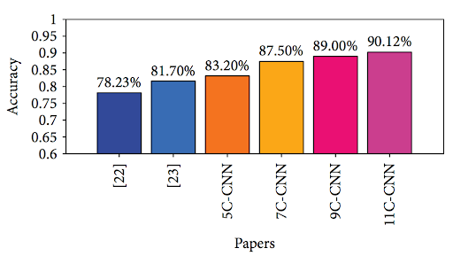
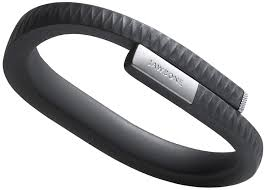
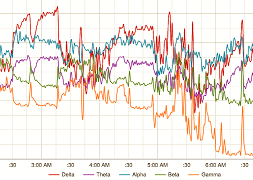
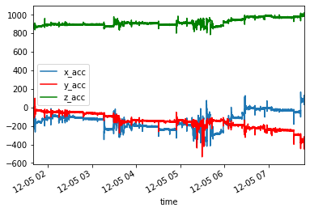
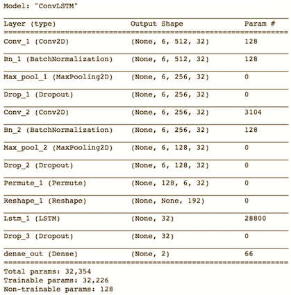

## REMtrack - REM Sleep Tracker

### Introduction

Rapid Eye Movement (REM) sleep is the final stage in the sleep cycle. Your brain becomes more active and stores long-term memories. The National Sleep Foundation states that REM sleep benefits learning, memory, and mood, and that a lack of it has adverse physical and emotional effects. Characteristic features of REM sleep include eye movements and paralysis of the arm and leg muscles. 

### Problem Statement

Sleep studies are expensive and impractical for users that wish to know more about their sleeping patterns. Polysomnography (PSG) monitors brain activity (EEG), eye movements (EOG), muscle activity (EMG), and heart rhythm (ECG), but is cumbersome and requires a trip to a sleep center or hospital. Sleep studies are expensive and impractical for a user that simply wants more information regarding their sleep cycles, or someone that wishes to track their sleep over time. 

Current at-home sleep trackers use movement (actigraphy) as the primary indicator of sleep cycles. However, this is based on the "assumption that people move most during wake states with a progressive reduction in motion as they approach the deepest stages of sleep" (1). This is an inaccurate way to classify REM sleep cycles. The goal of this project is to accurately track REM sleep without 
expensive EEG equipment and create a solution that is more comfortable than existing sleep wearables.

### Approach

The REMtrack solution involves a sleep mask with an integrated inertial measurement unit (IMU), as well as a pulse sensor. Heart rate has been shown to have "clear long-range correlations during REM sleep (H=0.78)", which means that it will be a useful tool to measure (2). These sensors will prevent the need for costly sleep studies, reduce the inaccuracies of at-home sleep tracking, and be cheaper and more comfortable than existing EEG headsets. 

### Prior Works

Recently, companies have begun to incorporate EEG monitoring into headbands in order to track sleep and meditative states. Muse and Dreem have each created solutions that are meant to inform users about their sleep patterns, including REM sleep. Unfortunately, these headbands are bulky and expensive (around $500), and are not a viable solution for all patients. Additionally, they are uncomfortable to wear for long period of time. Dreem has validated their hardware with research that indicates their device is as accurate as a polysomnogram, and the goal of REMtrack is to meet that same standard, with purely the IMU and pulse sensor. 

In other research, a Convolutional Neural Network achieved 90% accuracy for predicting REM sleep, but it used EEG data for training. With more EEG channels (electrodes hooked up to the patient), accuracy of the model increased. 

Additionally, the Jawbone up (motion based IMU sensor on wrist) tends to overestimate PSG total sleep time and sleep efficiency. For this wearable, "sound sleep” was positively associated with PSG time in N2 and time in REM, but REM stages were not able to be uniquely identified.

Even state of the art PSGs rely on Electrooculography (EOG) rather than eyelid IMU sensors, so the work presented here is a novel approach to REM sleep tracking. 

### Timeline & Deliverables
* Week 4 - Order materials and finalize hardware design
* Week 5 - Assemble and integrate hardware
* Week 6 - Begin testing Muse headband, implement data collection software for REMtrack
* Week 7 - Parallel testing of Muse and REMtrack
* Week 8 - Gather training data for intelligent sleep tracking 
* Week 9 - Create machine learning solution for sleep tracking
* Week 10 - Finalize model and compare with Muse

### Methodology

#### Assembly
A sparkfun IMU [MPU-9250](https://www.sparkfun.com/products/13762) is connected to an Arduino Uno microcontroller via an I2C interface. 

This IMU will rest on a sleep mask that tightly rests on the user's eyelids to sense movement. Additionally, the [heart rate sensor](https://www.sparkfun.com/products/11574) is connected to another Arduino Uno through an analog input. 

The sensors are powered with 3.3V lines from the microcontrollers. Both of these devices will stream data to serial ports on a Mac. Python scripts running on the Mac time stamp the data and save into CSV files.

#### Datasets
The raw data can be viewed at the following [DropBox link](https://www.dropbox.com/sh/2fkjsiwpo1naz6q/AABdRBSJ_QOWfcs7xz8bPXx7a?dl=0). Pulse data is collected and recorded with every heartbeat. Source code was adapted from the manufacturer to output the desired values, making use of the microcontroller's interrupt routines to send data at the correct times. IMU data is cross-referenced with the accelerometer and gyroscope readings from the Muse headband to filter out head movements and other large motions. IMU motion data is recorder every 500 ms, which provides enough data to create a significant amount of training samples for the neural network. 

#### Labeled Data/Ground Truth
The iOS application Muse Monitor was used to gain access to the raw EEG data. After data collection was completed for the night, the EEG brainwaves, gyroscope, accelerometer, and RAW data was uploaded to Dropbox. From there, the data was inspected to identify REM sleep. We will be looking for alpha, delta, and theta waves (in that order) which will then lead to the beginning of REM sleep -- a pattern with “sawtooth waves" that are low voltage, random, and fast (3). The timestamps from the Muse data is used to label IMU and pulse data on the to provide the basis for supervised learning. Here is an example of one night's data collection. We can identify 2 periods of REM sleep -- between 3:30AM and 3:40AM, and 5:15AM and 5:35AM. Notice the spike in theta waves before the different waves seem to come together indicating a sawtooth pattern.

We can see similar spikes in accelerometer data that occurs during the same time periods.

#### Learning Models
The raw labeled data from the IMU and pulse sensor will be used to train multivariate multi-step time series forecasting models. A likely candidate for a model is the long short-term memory (LSTM) recurrent neural network which is often used for processing sequences of data. LSTM units can be trained in a supervised fashion using an optimization algorithm, combined with backpropagation through time. 

#### Experimental Validation and Success Metrics
After gathering enough training data and correctly labeling it with the Muse device, we aimed to create a machine learning model that will be able to correctly classify REM sleep given solely the IMU and pulse sensor inputs. An accuracy of greater than 90% within a window of 2-3 minutes will be considered a successful project.

Based on the Human Activity Recognition code that is listed in the Resources sections, I created a Convolutional LSTM to classify the IMU data as being in REM sleep or not. Based on the graphs and correlation of the pulse sensor, I decided not to include this data to train the model. Additionally, the magnetometer data was extremely noisy and demonstrated significant drift, so I limited the model to only 6 features: accelerometer and gyroscope values for the X, Y, and Z axes. 

The model summary is shown below.

Data was collected over 21 nights, with each night yielding between 2 and 3 REM cycles. After examining the Muse headband EEG results, REM sleep was identified and labeled for the IMU data. By subsampling the data, I was able to get 420 total samples of 512 time steps (500 ms) each. This resulted in 294 training, 63 validation, 63 test samples with a 70-15-15 split. 

Running the ConvLSTM with a batch size of 256, loss function of sparse categorical crossentropy, an 'adam' optimizer, and training for 5 epochs, I was able to achieve an accuracy and mean f1 score of 0.9206. This beats our desired threshold of 90% accuracy and indicates a successful project. The confusion matrix is as follows: [[30  0] [ 5 28]]. With five false negatives, our model is incorrectly determining that IMU data from some parts of REM sleep is actually during regular sleep. This may be because of variations in eye movement or pauses that may occur during rapid-eye movement. 

#### Other Learning Models

Other types of neural networks have also been shown to be effective at human activity recognition. The following models were trained on the same IMU data (with and without dropout and batch normalization): Multilayer Perceptron (MLP), Convolutional Neural Network (CNN), and Long short term memory (LSTM). The results are summarized below. Some of the models were unable to classify the data and simply outputted all 0's or all 1's instead. 
 
MLP - no dropout, batch norm
[[30  0]
 [33  0]]
the mean-f1 score: 0.3226
accuracy is: 0.4762

CNN - no dropout, batch norm
[[30  0]
 [13 20]]
the mean-f1 score: 0.7883
accuracy is: 0.7937

LSTM - dropout, batch norm
[[ 0 30]
 [ 0 33]]
the mean-f1 score: 0.3438
accuracy is: 0.5238

The model summaries can be seen in the Jupyter notebook. Both LSTM and MLP were unsuccessful models as they were not able to differentiate between the two classes. The CNN was the best model of the 3, with an accuracy of 0.79, but it still pales in comparison to the recommended ConvLSTM which had an accuracy of greater than 0.9

#### Future Directions

Rather than have cumbersome wires coming out of the eyemask, a better design would involved an integrated battery and bluetooth chip. This would allow for freedom and full range of motion while sleeping. The process of manually labeling REM sleep data from the Muse EEG headband was tedious and could potentially be automted. 

Due to the time constraints of this project, data was collected for only one subject. Adding training data from multiple subjects would decrease overfitting and account for more varieties of rapid-eye movement, as well as each individual's unique sleep patterns. The system and predictive model could be connected to an alarm clock that would not wake someone up during REM sleep. Recommended wake-up/sleeping times could also be ascertained for optimal REM cycles and overall sleep. 

Another novel idea would be to incorporate an LED into the sleep mask which would gradually get brighter to encourage someone to wake up. This would only begin within a given wakeup window and would be after the completion of a REM cycle.

### References
1) [Validation of Sleep-Tracking Technology Compared with Polysomnography in Adolescents](https://academic.oup.com/sleep/article/38/9/1461/2418009)

2) [Dynamics of Heart Rate and Sleep Stages in Normals and Patients with Sleep Apnea](https://www.nature.com/articles/1300146)

3) [Stages of Human Sleep](http://sleepdisorders.sleepfoundation.org/chapter-1-normal-sleep/stages-of-human-sleep/)

4) [Automatic Sleep Stage Classification Based on Convolutional Neural Network and Fine-Grained Segments](http://downloads.hindawi.com/journals/complexity/2018/9248410.pdf)

5) [Choosing MUSE: Validation of a Low-Cost, Portable EEG System for ERP Research](https://www.ncbi.nlm.nih.gov/pmc/articles/PMC5344886/)

6) [Convolutional LSTM Network: A Machine Learning Approach for Precipitation Nowcasting](https://arxiv.org/abs/1506.04214)

### Resources
1) [Pulse Sensor](https://pulsesensor.com/)

2) [IMU](https://learn.sparkfun.com/tutorials/mpu-9250-hookup-guide/all)

3) [Muse Headband Data](https://mind-monitor.com/)

4) [Human Activity Recognition from IMU data using Deep Learning (Tensorflow)](https://github.com/vikranth94/Activity-Recognition)
