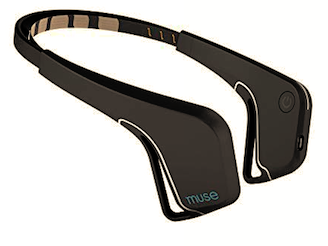
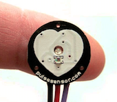

## REMtrack - REM Sleep Tracker

### Introduction

Rapid Eye Movement (REM) sleep is the final stage in the sleep cycle. Your brain becomes more active and stores long-term memories. The National Sleep Foundation states that REM sleep benefits learning, memory, and mood, and that a lack of it has adverse physical and emotional effects. Characteristic features of REM sleep include eye movements and paralysis of the arm and leg muscles. 

### Problem Statement

Sleep studies are expensive and impractical for users that wish to know more about their sleeping patterns. Polysomnography (PSG) monitors brain activity (EEG), eye movements (EOG), muscle activity (EMG), and heart rhythm (ECG), but is cumbersome and requires a trip to a sleep center or hospital. Sleep studies are expensive and impractical for a user that simply wants more information regarding their sleep cycles, or someone that wishes to track their sleep over time. 

Current at-home sleep trackers use movement (actigraphy) as the primary indicator of sleep cycles. However, this is based on the "assumption that people move most during wake states with a progressive reduction in motion as they approach the deepest stages of sleep" (1). This is an inaccurate way to classify REM sleep cycles. The goal of this project is to accurately track REM sleep without 
expensive EEG equipment and create a solution that is more comfortable than existing sleep wearables.

### Approach

The REMtrack solution involves a sleep mask with an integrated inertial measurement unit (IMU), as well as a pulse sensor. Heart rate has been shown to have "clear long-range correlations during REM sleep (H=0.78)", which means that it will be a useful tool to measure (2). These sensors will prevent the need for costly sleep studies, reduce the inaccuracies of at-home sleep tracking, and be cheaper and more comfortable than existing EEG headsets. 

### Prior Works

Recently, companies have begun to incorporate EEG monitoring into headbands in order to track sleep and meditative states. Muse and Dreem have each created solutions that are meant to inform users about their sleep patterns, including REM sleep. Unfortunately, these headbands are bulky and expensive (around $500), and are not a viable solution for all patients. Additionally, they are uncomfortable to wear for long period of time. Dreem has validated their hardware with research that indicates their device is as accurate as a polysomnogram, and the goal of REMtrack is to meet that same standard, with purely the IMU and pulse sensor. 

### Timeline & Deliverables
* Week 4 - Order materials and finalize hardware design
* Week 5 - Assemble and integrate hardware
* Week 6 - Begin testing Muse headband, implement data collection software for REMtrack
* Week 7 - Parallel testing of Muse and REMtrack
* Week 8 - Gather training data for intelligent sleep tracking 
* Week 9 - Create machine learning solution for sleep tracking
* Week 10 - Finalize model and compare with Muse

### Methodology

#### Assembly
A sparkfun IMU [MPU-9250](https://www.sparkfun.com/products/13762) is connected to an Arduino Uno microcontroller via an I2C interface. 

This IMU will rest on a sleep mask that tightly rests on the user's eyelids to sense movement. Additionally, the [heart rate sensor](https://www.sparkfun.com/products/11574) is connected to another Arduino Uno through an analog input. 

Both of these devices will stream data to serial ports on a Mac. Python scripts running on the Mac time stamp the data and save into CSV files.

#### Datasets
The raw data can be viewed at the following [DropBox link](https://www.dropbox.com/sh/2fkjsiwpo1naz6q/AABdRBSJ_QOWfcs7xz8bPXx7a?dl=0). Pulse data is collected and recorded with every heartbeat. Source code was adapted from the manufacture to output the desired values, making use of the microcontroller's interrupt routines to send data at the correct times. IMU data is cross-referenced with the accelerometer and gyroscope readings from the Muse headband to filter out head movements and other large motions. IMU motion data is recorder every 500 ms, which provides enough data to create a significant amount of training samples for the neural network. 

#### Labeled Data/Ground Truth
The iPhone application Muse Direct will be used to gain access to the raw EEG data. Data will be streamed to the Muse Direct cloud where it will be downloaded in a human-readable format and labeled. We will be looking for alpha, delta, and theta waves (in that order) which will then lead to the beginning of REM sleep -- a pattern with “saw tooth waves" that are low voltage, random, and fast (3). The labeled data will be used in conjuction with the IMU and pulse data on the Azure IoT server to correctly label different stages of sleep and provide the basis for supervised learning.

#### Learning Models
The raw labeled data from the IMU and pulse sensor will be used to train multivariate multi-step time series forecasting models. A likely candidate for a model is the long short-term memory (LSTM) recurrent neural network which is often used for processing sequences of data. LSTM units can be trained in a supervised fashion using an optimization algorithm, combined with backpropagation through time. 

#### Experimental Validation and Success Metrics
After gathering enough training data and correctly labeling it with the Muse device, we aim to create a machine learning model that will be able to correctly classify REM sleep given solely the IMU and pulse sensor inputs. An accuracy of greater than 90% within a window of 2-3 minutes will be considered a successful project. Stretch goals include providing sleep insights from the data and possible recommendations regarding sleep and waking times. 

### Sources
1) [Validation of Sleep-Tracking Technology Compared with Polysomnography in Adolescents](https://academic.oup.com/sleep/article/38/9/1461/2418009)

2) [Dynamics of Heart Rate and Sleep Stages in Normals and Patients with Sleep Apnea](https://www.nature.com/articles/1300146)

3) [Stages of Human Sleep](http://sleepdisorders.sleepfoundation.org/chapter-1-normal-sleep/stages-of-human-sleep/)
